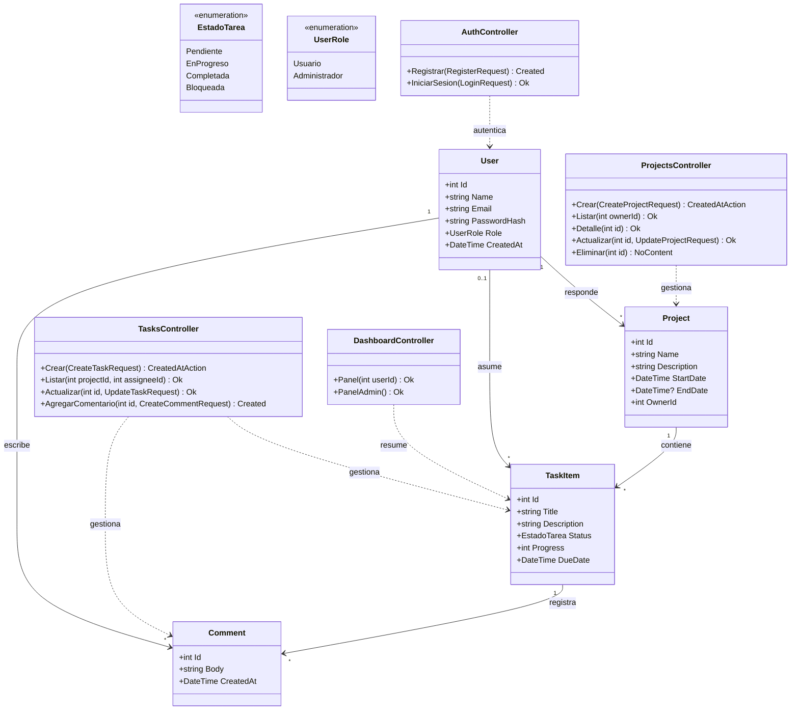

# Diagrama de clases · TaskFlow

```mermaid
classDiagram
    class User {
        +int Id
        +string Name
        +string Email
        +string PasswordHash
        +UserRole Role
        +DateTime CreatedAt
    }

    class Project {
        +int Id
        +string Name
        +string Description
        +DateTime StartDate
        +DateTime? EndDate
        +int OwnerId
    }

    class TaskItem {
        +int Id
        +string Title
        +string Description
        +EstadoTarea Status
        +int Progress
        +DateTime DueDate
    }

    class Comment {
        +int Id
        +string Body
        +DateTime CreatedAt
    }

    class EstadoTarea {
        <<enumeration>>
        Pendiente
        EnProgreso
        Completada
        Bloqueada
    }

    class UserRole {
        <<enumeration>>
        Usuario
        Administrador
    }

    class ProjectsController {
        +Crear(CreateProjectRequest) CreatedAtAction
        +Listar(int ownerId) Ok
        +Detalle(int id) Ok
        +Actualizar(int id, UpdateProjectRequest) Ok
        +Eliminar(int id) NoContent
    }

    class TasksController {
        +Crear(CreateTaskRequest) CreatedAtAction
        +Listar(int projectId, int assigneeId) Ok
        +Actualizar(int id, UpdateTaskRequest) Ok
        +AgregarComentario(int id, CreateCommentRequest) Created
    }

    class AuthController {
        +Registrar(RegisterRequest) Created
        +IniciarSesion(LoginRequest) Ok
    }

    class DashboardController {
        +Panel(int userId) Ok
        +PanelAdmin() Ok
    }

    User "1" --> "*" Project : responde
    Project "1" --> "*" TaskItem : contiene
    User "0..1" --> "*" TaskItem : asume
    TaskItem "1" --> "*" Comment : registra
    User "1" --> "*" Comment : escribe

    ProjectsController ..> Project : gestiona
    TasksController ..> TaskItem : gestiona
    TasksController ..> Comment : gestiona
    AuthController ..> User : autentica
    DashboardController ..> TaskItem : resume
```
