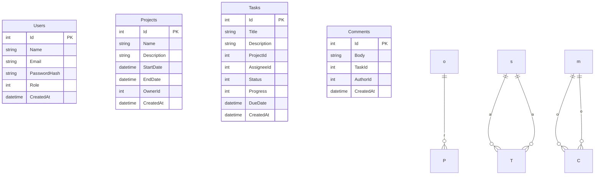

# Diagrama entidad-relacion · TaskFlow

```mermaid
erDiagram

    Users {
        int Id PK
        string Name
        string Email
        string PasswordHash
        int Role
        datetime CreatedAt
    }

    Projects {
        int Id PK
        string Name
        string Description
        datetime StartDate
        datetime EndDate
        int OwnerId
        datetime CreatedAt
    }

    Tasks {
        int Id PK
        string Title
        string Description
        int ProjectId
        int AssigneeId
        int Status
        int Progress
        datetime DueDate
        datetime CreatedAt
    }

    Comments {
        int Id PK
        string Body
        int TaskId
        int AuthorId
        datetime CreatedAt
    }

    o ||--o{ P : "r"
    s ||--o{ T : "a"
    s ||--o{ T : "a"
    m ||--o{ C : "o"
    m ||--o{ C : "o"
```
