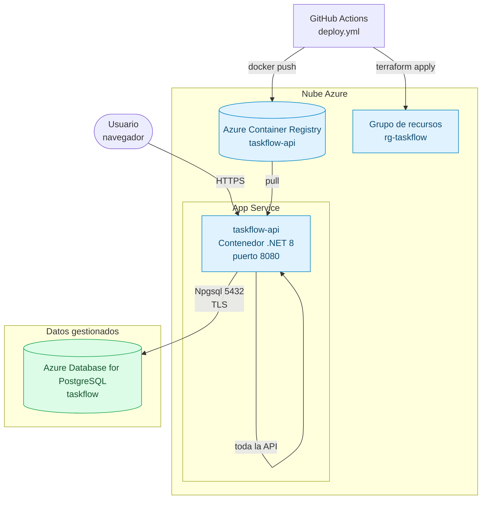
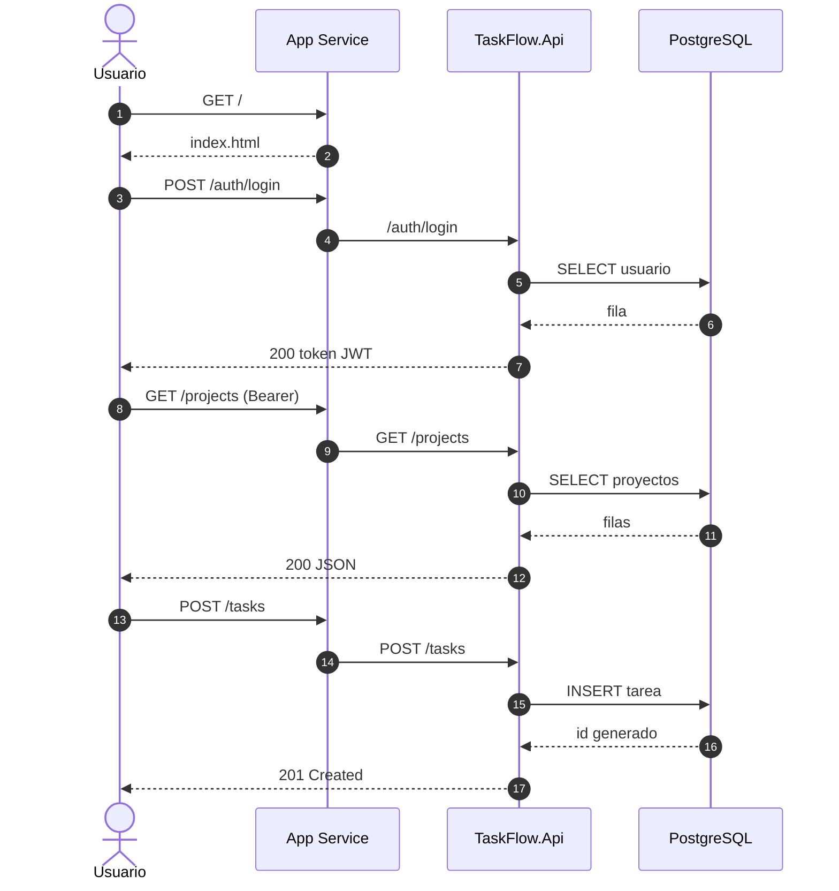

# Diagramas de despliegue · TaskFlow

## Vista de infraestructura

```mermaid
flowchart TB
    subgraph "Nube Azure"
        subgraph "App Service"
            Web["taskflow-api<br/>Contenedor .NET 8<br/>puerto 8080"]
        end
        ACR[("Azure Container Registry<br/>taskflow-api")]
        RG["Grupo de recursos<br/>rg-taskflow"]
    end

    subgraph "Datos gestionados"
        PG[("Azure Database for PostgreSQL<br/>taskflow")]
    end

    Usuario(["Usuario<br/>navegador"])

    Usuario -->|"HTTPS"| Web
    Web -->|"toda la API"| Web
    Web -->|"Npgsql 5432<br/>TLS"| PG
    CI["GitHub Actions<br/>deploy.yml"] -->|"docker push"| ACR
    ACR -->|"pull"| Web
    CI -->|"terraform apply"| RG

    classDef nube fill:#e0f2fe,stroke:#0284c7,color:#0c4a6e
    classDef datos fill:#dcfce7,stroke:#16a34a,color:#14532d
    class Web,ACR,RG nube
    class PG datos
```

## Secuencia de una peticion

```mermaid
sequenceDiagram
    autonumber
    actor U as Usuario
    participant W as App Service
    participant A as TaskFlow.Api
    participant P as PostgreSQL

    U->>W: GET /
    W-->>U: index.html
    U->>W: POST /auth/login
    W->>A: /auth/login
    A->>P: SELECT usuario
    P-->>A: fila
    A-->>U: 200 token JWT
    U->>W: GET /projects (Bearer)
    W->>A: GET /projects
    A->>P: SELECT proyectos
    P-->>A: filas
    A-->>U: 200 JSON
    U->>W: POST /tasks
    W->>A: POST /tasks
    A->>P: INSERT tarea
    P-->>A: id generado
    A-->>U: 201 Created
```
